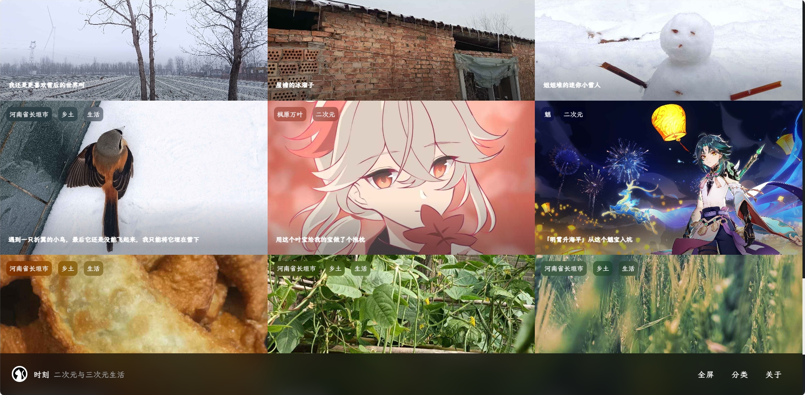
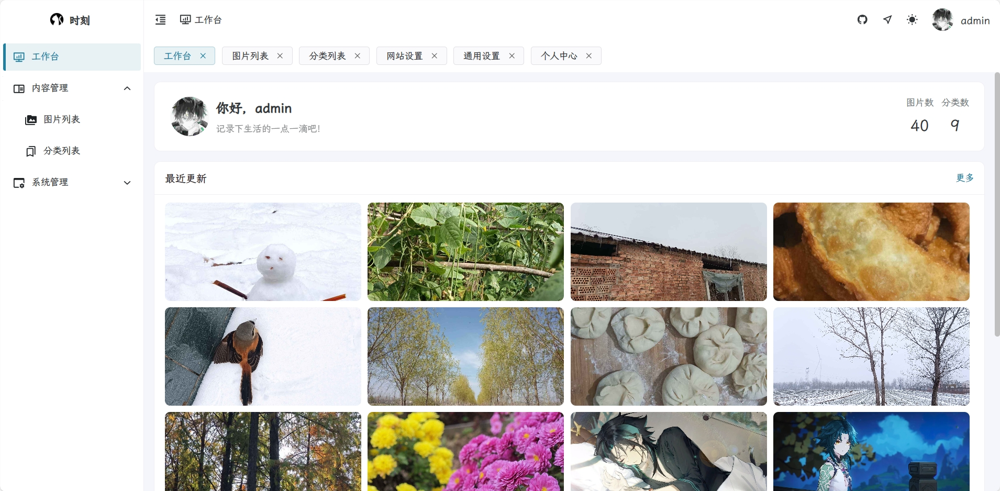
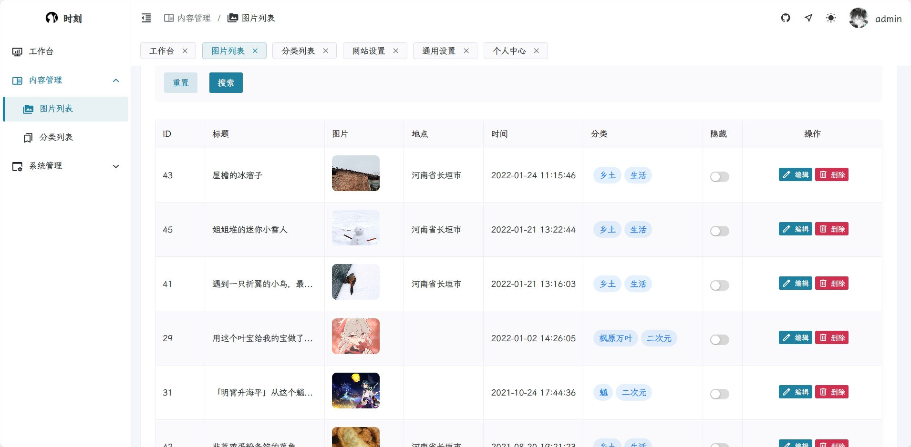
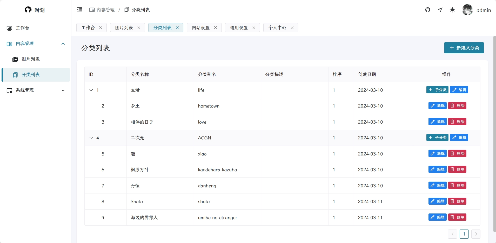
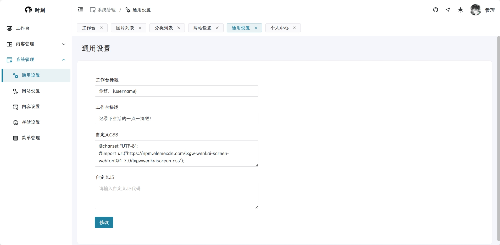
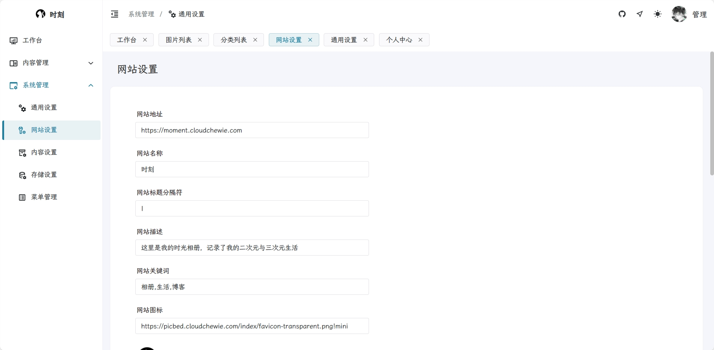
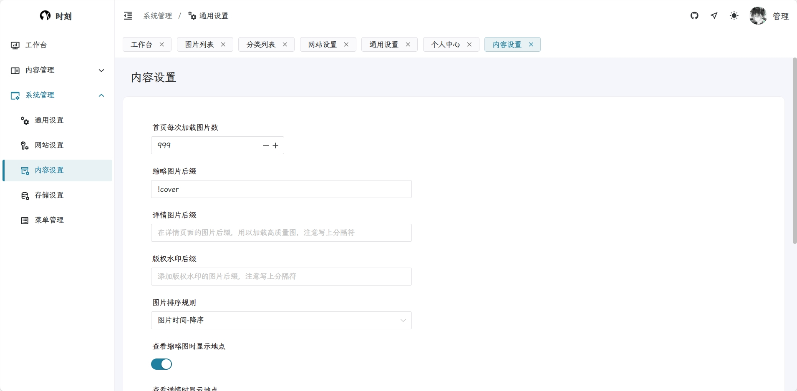
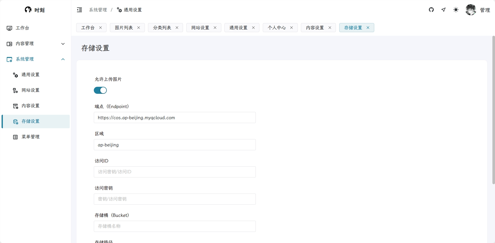
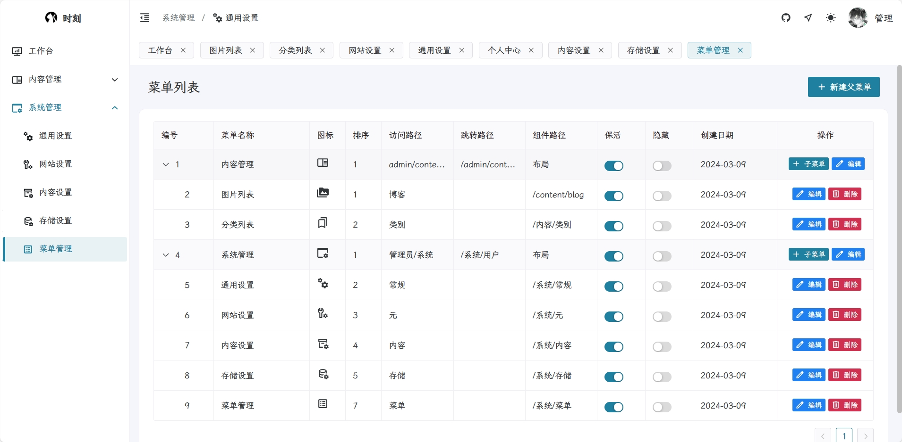

# Moment

## 简介

- 移植自[TimePlus](https://github.com/zhheo/TimePlus)和[time](https://github.com/wclk/time)的相册博客主题
- 脱离 Typecho 和 Mysql，基于[vue-fastapi-admin](https://github.com/mizhexiaoxiao/vue-fastapi-admin)使用 Vue+FastAPI 开发
- 随意发布你的图片、分类、地点
- 高程度自定义你的网站，自由管理网站 Meta、内容设置、菜单设置
- 快捷发布所见所闻，支持将图片上传至符合 S3 标准的存储桶中
- 预览在线效果：[时刻](https://moment.cloudchewie.com/)

## 部署

- 使用 Docker-compose 部署

  ```yaml
  services:
    moment:
      image: ruida/moment:latest
      container_name: moment
      volumes:
        - .moment:/app/data
      ports:
        - 9999:9999
  ```

## 迁移指南

### 从 v1.x 迁移至 v2.x

1. 为避免迁移失败，请**务必备份**你在 v1.x 版本的数据（容器内的`/opt/moment/app/data`目录）
2. 将你的数据目录（如.moment）挂载到 v2.x 版本的容器中（容器内的`/app/data`目录）
3. 运行 v2.x 版本的容器
4. 查看容器日志，确认是否有迁移错误（容器迁移日志示例如下）

```plaintext
2025-06-27 23:52:39 - Moment - INFO - 正在初始化应用...
2025-06-27 23:52:39 - Moment - INFO - 执行迁移: migrations_001.py for ./migrations/migrations_001.py
开始数据库迁移...
BlogImage表不存在，开始创建...
表结构创建完成
检测到 44 篇博客但没有图片记录，开始迁移...
✅ 已为博客 '测试' (ID: 1) 创建图片记录
✅ 已为博客 '咳咳' (ID: 2) 创建图片记录
...
✅ 已为博客 '小桥' (ID: 12) 创建图片记录
开始删除Blog表中的image字段...
image字段已删除
迁移完成
2025-06-28 22:48:26 - Moment - INFO - 迁移完成: migrations_001.py
2025-06-27 23:52:39 - Moment - INFO - 应用初始化完成
```

1. 如果没有错误，访问`<服务器IP地址>:9999/admin/workbench`
   > 如果迁移过程中出现错误，请提交 Issue，附上容器运行日志

## 使用指南

- 使用`<服务器IP地址>:9999`或`域名`访问相册
- 使用`<服务器IP地址>:9999/admin/workbench`或`<域名>/admin/workbench`访问后台管理
- 默认管理员账号：`admin`，密码：`123456`，请登录后及时修改用户名和密码
- 其他指南见[Wiki](https://github.com/Robert-Stackflow/Moment/wiki)

## 演示


















